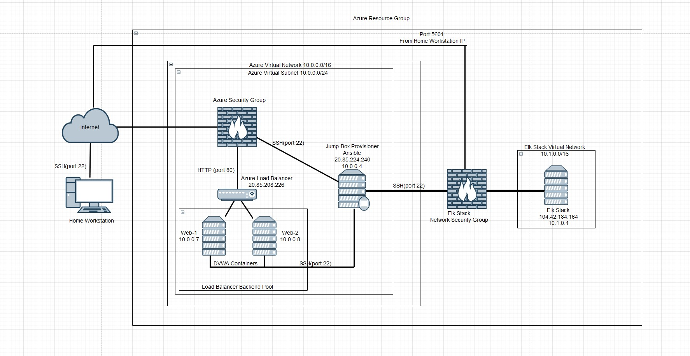
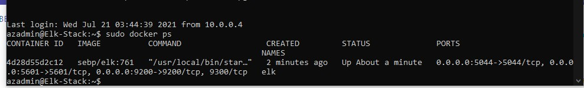

## Automated ELK Stack Deployment

The files in this repository were used to configure the network depicted below.

These files have been tested and used to generate a live ELK deployment on Azure. They can be used to either recreate the entire deployment pictured above. Alternatively, select portions of the yaml files may be used to install only certain pieces of it, such as Filebeat.

  - 
  - 
  - 

This document contains the following details:
- Description of the Topologu
- Access Policies
- ELK Configuration
  - Beats in Use
  - Machines Being Monitored
- How to Use the Ansible Build

### Description of the Topology

The main purpose of this network is to expose a load-balanced and monitored instance of DVWA, the D*mn Vulnerable Web Application.

Load balancing ensures that the application will be highly available, in addition to restricting access to the network.

Integrating an ELK server allows users to easily monitor the vulnerable VMs for changes to the logs and system performance.

The configuration details of each machine may be found below

| Name     | Function | IP Address | Operating System |
|----------|----------|------------|------------------|
| Jump Box | Gateway  | 10.0.0.4   | Linux            |
| Web-1    | DVWA     | 10.0.0.7   | Linux            |
| Web-2    | DVWA     | 10.0.0.8   | Linux            |
| Elk-Stack| Elk-Stack| 10.1.0.4   | Linux            |

### Access Policies

The machines on the internal network are not exposed to the public Internet. 

Only the Jump Box machine can accept connections from the Internet. Access to this machine is only allowed from the following IP addresses:
- Home Machine IP address

Machines within the network can only be accessed by the Jump Box (10.0.0.4).

A summary of the access policies in place can be found in the table below.

| Name      | Publicly Accessible | Allowed IP Addresses    |
|-----------|---------------------|-------------------------|
| Jump Box  |          No         | Home Machine            |
| Web-1     |          No         | 10.0.0.4  10.1.0.4      |
| Web-2     |          No         | 10.0.0.4  10.1.0.4      |
| Elk Stack |          No         | 10.0.0.4  Home Machine  |

### Elk Configuration

Ansible was used to automate configuration of the ELK machine. No configuration was performed manually, which is advantageous because the files can be reused to configure any Ansible machine.

The playbook implements the following tasks:
- installs docker.io and python3-pip
- uses pip to install the docker module
- increases the memory of the virtual machine
- downloads then launches the elk container

The following screenshot displays the result of running `docker ps` after successfully configuring the ELK instance.

### Target Machines & Beats
This ELK server is configured to monitor the following machines:
- Web-1 10.0.0.7
- Web-2 10.0.0.8

We have installed the following Beats on these machines:
- Filebeat
- Metricbeat

These Beats allow us to collect the following information from each machine:
- Filebeat collects log events, used to see changes any log files such as the system.log or wifi.log
- Metricbeat monitors the server by collecting metrics from the system and services running, allowing us to see ram/cpu usage of each service.

### Using the Playbook
In order to use the playbook, you will need to have an Ansible control node already configured. Assuming you have such a control node provisioned: 

SSH into the control node and follow the steps below:
- Copy the hosts.yml file to /etc/ansible/hosts
- Update the hosts file to include the elk server ip [10.1.0.4] seperate from the webservers
- Run the playbook, and navigate to 104.42.184.164:5601 to check that the installation worked as expected.
